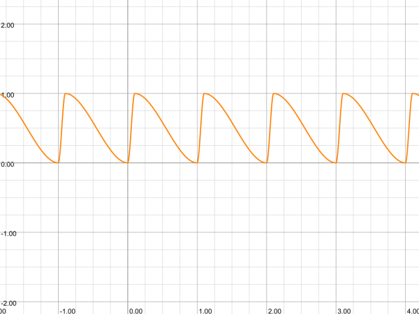
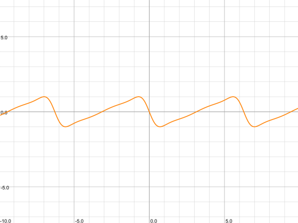
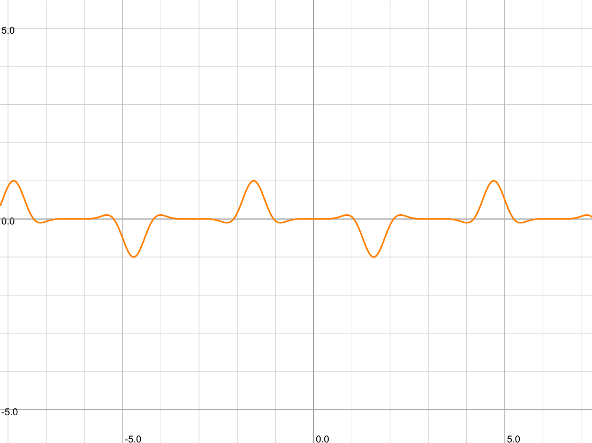

本文学习 Shadertoy 上一个人气很高的作品 Heartfelt:

<iframe width="640" height="360" frameborder="0" src="https://www.shadertoy.com/embed/ltffzl?gui=true&t=10&paused=true&muted=false" allowfullscreen></iframe>

这个作品在 Shadertoy 的 likes 排行榜上属于 top20 的存在，复杂程度适中，作者还贴心的在 YouTube 上给出了视频讲解 ([YouTube 地址](https://youtu.be/EBrAdahFtuo))，这里根据我的理解再做一个逐行的详细分析。

Shadertoy 上的许多精彩程序有个共同的特点，就是它们的代码包含的信息量非常大，某段不起眼的代码往往都有特定的意图，并且对渲染结果有决定性的影响。学习的人不经过手动复现，反复比较后是很难理解的。

Shader 编程主要基于距离场 (signed distance field) 的技术，这个过程非常类似从一块石料出发雕刻艺术品：

1. 给定一个 uv 空间，这就好比一块毛坯石料。
2. 通过距离场函数来搭建场景，这就好比在石料上用画笔描出轮廓，然后切割，形成作品大致的形状。
3. 使用 `smoothstep`, `clamp` 之类的函数，突出想要的细节。这就好比对石料精细打磨，让沟壑、曲线凸显出来。
4. 对场景上色。

本文针对初步接触 shader 的读者，会花很多篇幅在讲解基础的技巧上。文中的代码都是可以在左侧的窗口中实时看到效果的。


# 第一步：画网格

在 Heartfelt 这个作品中，雨滴分为两种：

+ 第一种是静态雨滴，它们由于质量比较小，重力不足以克服与屏幕的摩擦力，所以落在屏幕上以后并不会移动，而是原地缓慢蒸发掉。
+ 第二种是动态雨滴，它们质量比较大，会在屏幕上滑落，并在轨迹上延伸出一条水迹。

这两种雨滴是分别绘制的，不管哪一种都需要将屏幕切分为网格，所以要理解 Heartfelt 这个作品，首先要掌握怎样画正方形网格。这也是 shader 中最基本的操作，来看一下：

<div class="codeAndCanvas" data="void mainImage(out vec4 fragColor, in vec2 fragCoord) {
    vec2 uv = fragCoord / iResolution.y;
    uv *= 8.0;
    uv = fract(uv) - 0.5;
    vec2 dd = 0.5 - abs(uv);
    float d = min(dd.x, dd.y);
    d = smoothstep(0.05, 0.0, d);
    vec3 col = vec3(d, 0, 0);
    fragColor = vec4(col, 1.0);
}">
</div>

1. **第 2，3 行**：这两行是将窗口的像素坐标 `fragCoord` 映射为平面上的直角坐标 uv，uv 的变化范围是 $[0, 8w/h] \times [0,8]$，其中 $w,h$ 分别是窗口的宽度和高度。
2. **第 3 行**：这一步是关键，`fract` 这个函数的作用是返回输入值的小数部分，这是个周期为 1 的函数，`uv = fract(uv)` 会把整个 uv 区域分成若干个单位方格，每个单位方格本身是一个坐标范围是 $[0,1]\times[0,1]$ 的局部坐标空间。返回的新的 uv 值是当前位置在方格中的坐标。**所以本质上`fract` 是一种特殊的坐标变换，它在生成周期性的结构时非常有用**。减去 0.5 是再作了一次平移，使得原点位于方格的中心。

    `fract` 函数经常和 `floor` 函数一起调用：`floor(uv)` 会返回 uv 所在方格左下角的整点坐标，这可以告诉 uv 位于哪个方格中；`fract(uv) - 0.5` 会告诉我们 uv 在这个方格中相对于方格中心的位置。

4. **第 4, 5 行**：现在 uv 属于某个方格中，取值范围是 $[-0.5,0.5]\times[-0.5, 0.5]$，`d` 是 uv 分别到垂直、水平两种网格线距离绝对值的最小者，`d` 越小当前位置就越接近网格线，uv 落在网格线上当且仅当 `d = 0`。
5. **第 7 行**：为了绘制具有一定宽度的网格线，我们使用了 `d = smoothstep(0.05, 0.0, d)` 这个处理。`smoothstep(b, a, x)` 在 b > a 时是一个从 a 到 b 平滑地从 1 降低为 0 的函数，所以 `d = smoothstep(0.05, 0.0, d)` 会让 d 从网格线开始 (d = 0.0 的位置)，到距离网格线 0.05 的地方为止，平滑地由 1 降低到 0。
6. **第 8, 9 行**：我们用 d 的值作为最终颜色的 r 分量在屏幕上显示出来，可以看到距离网格线 在 0.05 以内的点都是红色，超出这个距离的点都是黑色。即网格线的宽度是 0.1。

我们把绘制网格的代码提取出来放在一个函数里面，后面可以直接使用它：

```glsl
vec3 draw_grid(vec2 uv) {
    vec2 dd = 0.5 - abs(uv);
    float d = min(dd.x, dd.y);
    d = smoothstep(0.05, 0.0, d);
    return vec3(d, 0, 0);
}
```

# 第二步：画静态雨滴

这一步来给每个方格中加上一个静态的雨滴。首先我们在每个方格中心画一个圆形的雨滴，为此用 `d = length(uv)` 计算当前 uv 到方格中心 (0, 0) 的距离：

<div class="codeAndCanvas" data="void mainImage(out vec4 fragColor, in vec2 fragCoord) {
    vec2 uv = fragCoord / iResolution.y;
    uv *= 8.0;
    uv = fract(uv) - 0.5;
    float d = length(uv);
    d = smoothstep(0.12, 0.1, d);
    vec3 col = vec3(d);
    col += draw_grid(uv);
    fragColor = vec4(col, 1.0);
}">
</div>
</p>

这里我们使用 `smoothstep` 函数对 d 做了一个后期雕琢，让它在距离原点为 0.1 以内的部分是 1，0.1 之外的部分快速衰减到 0。这样可以起到平滑的效果。把 d 作为颜色显示出来，就会看到每个方格中心出现了一个半径是 0.1 的白色圆点，它们是 d = 1 的部分，黑色对应的是 d = 0 的部分。

我们希望静态的雨滴具有如下特点：

1. 它们的位置应该随机地出现在方格中，而不总是出现在中心。
2. 每个雨滴应该有快速出现，然后缓慢地蒸发消失的过程。
3. 雨滴之间出现和消失的时间应该是随机的，不能所有雨滴一起冒出来然后一起消失。
4. 我们应该可以调整雨滴的质量，让有的雨滴看起来比较厚重，有的比较轻薄。


为此我们需要写一个噪声函数 `vec3 noise(vec2 id)`，让它根据每个方格的 id 值返回一个 `vec3`，这个 `vec3` 的 xy 分量用来控制雨滴的位置，z 分量用来控制雨滴的时间。

方格的 id 值可以选择为方格左下角的整点坐标。

```glsl
vec3 noise(vec2 p) {
    vec3 p3 = fract(vec3(p.xyx) * vec3(0.1031, 0.11369, 0.13787));
    p3 += dot(p3, p3.yzx + 33.33);
    return fract((p3.xxy + p3.yzz) * p3.zyx);
}
```

这个 `noise` 函数会对一个 `vec2` 类型的输入返回一个 `vec3` 类型的值。它并不是随机的，固定的输入总是返回相同的结果，不过它使用了一些眼花缭乱的参数和操作使得输出的值杂乱无章，这样可以制造出随机的效果。


<div class="codeAndCanvas" data="void mainImage(out vec4 fragColor, in vec2 fragCoord) {
    vec2 uv = fragCoord / iResolution.y;
    uv *= 8.0;
    vec2 id = floor(uv);
    uv = fract(uv) - 0.5;
    vec3 n = noise(id);
    vec2 pos = (n.xy - 0.5) * 0.7; 
    float d = length(uv - pos);
    d = smoothstep(0.15, 0.1, d);
    vec3 col = vec3(d);
    col += draw_grid(uv);
    fragColor = vec4(col, 1.0);
}">
</div>
</p>

第 4 行我们在对 `uv` 取 `fract` 操作之前通过 `floor` 获得了 `uv` 所在方格的左下角的整点坐标 `id`，然后用 `noise` 函数来获得一个与 `id` 相关的 `vec3 n`，然后用 `n.xy` 来得到一个雨滴的位置 `pos`。`pos` 的取值范围是 $[-0.35, 0.35]\times[-0.35, 0.35]$。

为了营造出雨滴缓慢蒸发的效果，我们需要引入时间参数 t，让雨滴周期性地重复出现、消失这个过程。我们只需要给雨滴的密度 d 乘以一个周期性地、快速地从 0 变化到 1，然后缓慢地从 1 变化到 0 的函数 $f(t)$。我们首先在 $[0,1]$ 区间上构造一个快速上升到 1 然后缓慢下降到 0 的函数：

```glsl
float saw(float b, float t) {
    t = fract(t);
    return smoothstep(0.0, b, t) * smoothstep(1.0, b, t); 
}
```

这个函数是一个周期为 1 的尖峰函数，它的尖点在 t = b 处，其中 0 < b < 1 是一个可调的参数。如果我们取 b 使得它比较接近 0 的话，那么它会从 0 开始快速上升到 b，然后从 b 缓慢下降到 1。然后重复此过程。它大致长这样：([graphtoy 在线版](https://graphtoy.com/?f1(x,t)=smoothstep(0.0,%200.1,%20fract(x))%20*%20smoothstep(1.0,%200.1,%20fract(x))&v1=true&f2(x,t)=&v2=true&f3(x,t)=&v3=true&f4(x,t)=&v4=true&f5(x,t)=&v5=false&f6(x,t)=&v6=true&grid=2&coords=1.1602453004690274,0.2261019960533055,2.6233835304378657))



我们看看把时间参数 t 代入这个函数然后乘到 d 上的效果：

<div class="codeAndCanvas" data="void mainImage(out vec4 fragColor, in vec2 fragCoord) {
    vec2 uv = fragCoord / iResolution.y;
    uv *= 8.0;
    vec2 id = floor(uv);
    uv = fract(uv) - 0.5;
    vec3 n = noise(id);
    vec2 pos = (n.xy - 0.5) * 0.7; 
    float d = length(uv - pos);
    d = smoothstep(0.15, 0.1, d);
    float t = iTime * 0.05 + n.z;
    float fade = saw(0.025, t);
    fade *= fract(10. * n.z);
    d *= fade;
    vec3 col = vec3(d);
    col += draw_grid(uv);
    fragColor = vec4(col, 1.0);
}">
</div>
</p>

这里重要的地方在第 10 行时间参数 t 的定义。我们通过给全局时间 `iTime` (单位是秒) 乘以一个常数 0.05 来控制时间的尺度 (相当于以实际时间的 20s 为动画中的 1 个单位时间)，然后用 `fract(iTime * 0.05 + n.z)` 来制造周期性的时间值，为什么还要加上 `n.z` 呢？这是为了打乱方格之间的时间同步，即将每个方格的时间各自拨快一个随机值 `n.z`，这样可以避免所有雨滴使用同一个全局的时间，从而导致雨滴同步地出现/消失。

在第 12 行，我们通过给 `fade` 再乘以一个随机值 `fract(n.z * 10.0)` (其它值比如 `abs(sin(n.z * 6.28))` 也是可以的) 来修改雨滴密度值，使得之前密度恒为 1 的雨滴的密度可以取值小于 1，从而营造出雨滴轻重不一的效果。

我们把上面画静态雨滴的代码提取出来作为一个函数：

```glsl
float static_drops(vec2 uv) {
    vec2 uv = fragCoord / iResolution.y;
    uv *= 8.0;
    vec2 id = floor(uv);
    uv = fract(uv) - 0.5;
    vec3 n = noise(id);
    vec2 pos = (n.xy - 0.5) * 0.7; 
    float d = length(uv - pos);
    d = smoothstep(0.15, 0.1, d);
    float t = iTime * 0.05 + n.z;
    float fade = saw(0.025, t);
    fade *= fract(10. * n.z);
    d *= fade;
    return d;
}
```

# 第三步：画动态雨滴


在我最初看到这个 Heartfelt 这个作品的时候，我是很惊讶作者是如何做到让水滴弯弯扭扭地流下来的，而且还能留下对应的轨迹。这得很复杂吧？其实并没有，不过要处理的细节确实比静态水滴要多一些。我们来分步讲解：

首先我们还是要划分网格，每个格子里面只有一个下落的雨滴 (想不到吧？)。为了让这个格子能容下雨滴的移动，它不应该是一个方格，而是一个狭长的带状区域：

<div class="codeAndCanvas" data="void mainImage(out vec4 fragColor, in vec2 fragCoord) {
    vec2 uv = fragCoord / iResolution.y;
    vec2 aspect = vec2(2, 1);
    vec2 grid = 4.0 * aspect;
    uv = fract(uv * grid) - 0.5;
    float d = length(uv);
    vec3 col = vec3(0);
    col += draw_grid(uv);
    fragColor = vec4(col, 1.0);
}">
</div>
</p>

这里我们给 uv 额外乘了一个 `aspect`，这是一个改变横纵比的变换，横坐标的范围是 0~8，水平方向上会出现 8 个矩形；但是垂直方向上范围是 0~4，只有 4 个矩形。所以网格在水平方向上变细了。但是这些网格排列的太整齐了，垂直下落的雨滴不应该是 8 个一排这样下落，我们需要打乱这些矩形的高度：

<div class="codeAndCanvas" data="#define hash11(x) fract(x * 17.0 * fract(x * 0.3183099))

void mainImage(out vec4 fragColor, in vec2 fragCoord) {
    vec2 uv = fragCoord / iResolution.y;
    vec2 aspect = vec2(2, 1);
    vec2 grid = 4.0 * aspect;

    vec2 id = floor(uv * grid);
    uv.y += hash11(id.x);
    uv *= grid;

    id = floor(uv);
    uv = fract(uv) - 0.5;
    vec3 col = vec3(0);
    col += draw_grid(uv);
    fragColor = vec4(col, 1.0);
}">
</div>
</p>

发生了什么？奥秘在 8, 9 两行：我们首先用 `floor(uv * grid)` 获取矩形的 `id`，然后根据 `id.x`，也就是矩形所在的列的编号，生成一个噪声值 `hash11(id.x)`，这里 `hash11` 可以是任何一个看起来没有什么规律的函数。用这个噪声值将 uv 所在的列做一个整体的向下平移。具有相同 `id.x` 的那些矩形，也即网格的每一列，会各自向下移动。然后利用这个新的 uv 重新计算网格，得到的就是列之间错开的网格了。

> **思考**：12 行处我们为什么要重新计算新的 `id`，使用旧的有什么问题吗？
>
> 记住这个问题，答案在后面。

接下来我们给每个矩形中加入雨滴。我们还是先从静态的雨滴开始，然后再让它动起来：

<div class="codeAndCanvas" data="#define hash11(x) fract(x * 17.0 * fract(x * 0.3183099))

void mainImage(out vec4 fragColor, in vec2 fragCoord) {
    vec2 uv = fragCoord / iResolution.y;
    vec2 aspect = vec2(2, 1);
    vec2 grid = 4.0 * aspect;
    vec2 id = floor(uv * grid);
    uv.y += hash11(id.x);
    uv *= grid;
    id = floor(uv);
    uv = fract(uv) - 0.5;

    float x = 0.0;
    float y = 0.0;
    vec2 dropPos = (uv - vec2(x, y)) / aspect;
    float d = length(dropPos);
    d = smoothstep(0.07, 0.05, d);

    vec3 col = vec3(d);
    col += draw_grid(uv);
    fragColor = vec4(col, 1.0);
}">
</div>
</p>

这里绘制雨滴的代码和之前一样：取 (x, y) 为雨滴的位置 (目前 x = y = 0.0) 并计算 uv 到它的距离。`dropPos` 表示当前 uv 到雨滴的相对位置。注意除以 aspect 这个操作：虽然 uv 的 xy 坐标的范围都是 -0.5~0.5，但是它的横纵比是不对的，这个坐标下的单位正方形是图中压扁了的矩形，圆形其实也是个压扁了的椭圆。要绘制一个正常的圆我们需要把横纵比纠正回去。所以 `length(dropPos)` 就是当前位置到雨滴的横纵比正确的距离，我们用 `smoothstep` 将距离小于 0.07 的部分保留，得到的就是半径 0.07 的圆形雨滴。

为了让雨滴动起来，我们分别考虑雨滴在垂直和水平方向的移动。作者希望让雨滴快速下落，停住，再下落，为此他设计了一个巧妙的关于时间 t 的函数来控制水滴的纵向移动：

```glsl
float y(float t) {
    return -sin(t + sin(t + sin(t) * 0.5)) * 0.45;
}
```
这里乘以 0.45 是因为 `sin` 的范围是 $[-1.0, 1.0]$，而 uv 的范围只有 $[-0.5, 0.5]$。

这个函数的图像如下：(去掉 0.45 的因子)



由图像可见确实 $y$ 爬升的很慢，但是下降的很快。把这个函数代入 shader 里：

<div class="codeAndCanvas" data="#define hash11(x) fract(x * 17.0 * fract(x * 0.3183099))

void mainImage(out vec4 fragColor, in vec2 fragCoord) {
    vec2 uv = fragCoord / iResolution.y;
    vec2 aspect = vec2(2, 1);
    vec2 grid = 4.0 * aspect;
    vec2 id = floor(uv * grid);
    uv.y += hash11(id.x);
    uv *= grid;
    id = floor(uv);
    uv = fract(uv) - 0.5;

    float t = iTime;
    float x = 0.0;
    float y = -sin(t + sin(t + sin(t) * 0.5)) * 0.45;

    vec2 dropPos = (uv - vec2(x, y)) / aspect;
    float d = length(dropPos);
    d = smoothstep(0.07, 0.05, d);
    vec3 col = vec3(d);
    col += draw_grid(uv);
    fragColor = vec4(col, 1.0);
}">
</div>
</p>
你可能要问了，诶，雨滴不是应该一直下降么？这样爬升是不对的呀？这就是个 trick 的地方了：雨滴在矩形内部是相对于矩形作上下往复运动的 (相对运动)，但是作者让整个网格匀速向下运动 (绝对运动)，两个速度叠加，雨滴的绝对速度 = 网格的绝对速度 + 雨滴相对网格的速度，只要网格下落的足够快就可以抵消掉雨滴向上运动的速度，所以我们只要加上一行 `uv.y += iTime * 0.25` 就足够了：(uv 上移 = 画在 uv 空间中的对象下移)

<div class="codeAndCanvas" data="#define hash11(x) fract(x * 17.0 * fract(x * 0.3183099))

void mainImage(out vec4 fragColor, in vec2 fragCoord) {
    vec2 uv = fragCoord / iResolution.y;
    vec2 aspect = vec2(2, 1);
    vec2 grid = 4.0 * aspect;
    vec2 id = floor(uv * grid);
    uv.y += hash11(id.x);
    uv *= grid;
    uv.y += iTime * 0.25;
    id = floor(uv);
    uv = fract(uv) - 0.5;

    float t = iTime;
    float x = 0.0;
    float y = -sin(t + sin(t + sin(t) * 0.5)) * 0.45;
    vec2 dropPos = (uv - vec2(x, y)) / aspect;
    float d = length(dropPos);
    d = smoothstep(0.07, 0.05, d);
    vec3 col = vec3(d);
    col += draw_grid(uv);
    fragColor = vec4(col, 1.0);
}">
</div>
</p>

可以看到动画中雨滴在矩形内仍然是上下往复运动的，但是相对于屏幕是一直下落的。

接下来我们来给雨滴的尾迹加上小水珠。这些小水珠应该是相对于整个屏幕是不动的，而不是随着雨滴下落，所以如果使用 uv 来计算水珠的话，必须抵消掉之前 uv 关于 `iTime` 的平移量：

<div class="codeAndCanvas" data="void mainImage(out vec4 fragColor, in vec2 fragCoord) {
    vec2 uv = fragCoord / iResolution.y;
    vec2 aspect = vec2(2, 1);
    vec2 grid = 4.0 * aspect;
    vec2 id = floor(uv * grid);
    uv.y += hash11(id.x);
    uv *= grid;
    uv.y += iTime * 0.25;
    id = floor(uv);
    uv = fract(uv) - 0.5;

    //float t = iTime;
    float x = 0.0;
    //float y = -sin(t + sin(t + sin(t) * 0.5)) * 0.45;
    //vec2 dropPos = (uv - vec2(x, y)) / aspect;
    //float d = length(dropPos);
    //d = smoothstep(0.07, 0.05, d);

    vec2 trailPos = (uv - vec2(x, iTime*0.25)) / aspect;
    trailPos.y = (fract(trailPos.y * 6.) - 0.5) / 6.;
    float trail = length(trailPos);
    trail = smoothstep(0.05, 0.03, trail);
    float d = trail;

    vec3 col = vec3(d);
    col += draw_grid(uv);
    fragColor = vec4(col, 1.0);
}">
</div>
</p>
这里绘制水珠的代码由 19-23 行给出。可见水珠是停在屏幕上不动的，只有网格在动。

19 行这里作者把原点的位置设在 `(x, iTime*0.25)` 处，这个位置相对于当前矩形区域是随着时间上移的，但是我们知道矩形区域相对于屏幕是随着时间下移的，下移的距离也是 `iTime*0.25`，所以二者抵消，水珠挂在屏幕上不动。

但是我们不希望雨滴的下方出现水珠，这不合理，所以需要给 `trail` 乘以一个在雨滴下方是 0，在雨滴上方是 1 的函数。这好办：雨滴中心的位置是 `dropPos.y = 0`，这正是水珠的分界线，所以 `smoothstep(-0.05, 0.05, dropPos.y)` 就是这样的函数。

此外我们希望模拟雨滴在下落过程中，尾迹中的水珠逐渐由小变大的过程，所以需要给 `trail` 再乘以一个最高处是 0 (uv.y = 0.5)，到雨滴处是 1 (uv.y = y)，且逐渐增大的函数。而 `smoothstep(0.5, y, uv.y)` 正是这样的函数。把它们加入上面的代码，我们得到如下效果：

<div class="codeAndCanvas" data="void mainImage(out vec4 fragColor, in vec2 fragCoord) {
    vec2 uv = fragCoord / iResolution.y;
    vec2 aspect = vec2(2, 1);
    vec2 grid = 4.0 * aspect;
    vec2 id = floor(uv * grid);
    uv.y += hash11(id.x);
    uv *= grid;
    uv.y += iTime * 0.25;
    id = floor(uv);
    uv = fract(uv) - 0.5;

    float t = iTime;
    float x = 0.0;
    float y = -sin(t + sin(t + sin(t) * 0.5)) * 0.45;
    vec2 dropPos = (uv - vec2(x, y)) / aspect;
    float d = length(dropPos);
    d = smoothstep(0.07, 0.05, d);

    vec2 trailPos = (uv - vec2(x, iTime*0.25)) / aspect;
    trailPos.y = (fract(trailPos.y * 6.) - 0.5) / 6.;
    float trail = length(trailPos);
    trail = smoothstep(0.05, 0.03, trail);
    trail *= smoothstep(-0.05, 0.05, dropPos.y);
    trail *= smoothstep(0.5, y, uv.y);
    d += trail;

    vec3 col = vec3(d);
    col += draw_grid(uv);
    fragColor = vec4(col, 1.0);
}">
</div>
</p>
注意 17, 18 两行，你可以把它们分别注释掉看看效果的变化。

接下来我们要进一步改进雨滴的效果，有这么几件事情要做：

1. 改变雨滴的位置，让它们各自出现在矩形中随机的位置。(噪声！)
2. 打乱雨滴之间的时间同步。(噪声 again)
3. 修改雨滴的形状，不要总是呈现圆形。(把 uv 胡乱搅合一下)
4. 让雨滴在水平方向上也扭起来，不要总是垂直下落。(和竖直方向类似，搞个横向抖起来的函数就行)

我们分别来解释：

下图显示了一个扭曲的圆形：

<div class="codeAndCanvas" data="void mainImage(out vec4 fragColor, in vec2 fragCoord) {
    vec2 uv = (2. * fragCoord - iResolution.xy) / iResolution.y;
    vec2 cen = vec2(0.3, 0);
    cen.y -= (uv.x - cen.x) * (uv.x - cen.x);
    float d = length(uv - cen);
    d = smoothstep(0.22, 0.2, d);
    vec3 col = vec3(d, 0, 0);
    fragColor = vec4(col, 1.0);
}">
</div>
</p>
这里的关键在第 4 行，如果没有这一行的话代码画的是一个圆心在 (0.3, 0) 处的圆，加上这一行以后变成了一个下粗上细的水滴形状。我们可以把这个形状的方程写出来：设 cen = (a, b)，uv = (x, y)，则 d 对应的数学表达式是
$$\sqrt{(x-a)^2 + (y - b + (x - a)^2)^2}.$$
根号里面是一个四次多项式，它是即雨滴的形状。

<script type="text/javascript" src="/glsl/raindrop/glslPost.js"></script>

为了让雨滴横向扭起来，作者设计了另一个 wiggle 函数如下：

```glsl
float wiggle(float w) {
    return sin(3. * w) * pow(sin(w), 6.);
}
```

这仍然是一个周期函数，振幅是 1，它长这样：



我们来看看效果：

<div class="codeAndCanvas" data="void mainImage(out vec4 fragColor, in vec2 fragCoord) {
    vec2 uv = fragCoord / iResolution.y;
    vec2 aspect = vec2(2, 1);
    vec2 grid = 4.0 * aspect;
    vec2 id = floor(uv * grid);
    uv.y += hash11(id.x);
    uv *= grid;
    uv.y += iTime * 0.25;
    id = floor(uv);
    uv = fract(uv) - 0.5;

    vec3 n = noise(id);
    float t = iTime + n.z * 6.28;
    float x = (n.x - 0.5) * 0.8;
    float w = (fragCoord.y / iResolution.y) * 10.0; 
    x += sin(3. * w) * pow(sin(w), 6.) * 0.45 * (0.4 - abs(x));
    float y = -sin(t + sin(t + sin(t) * 0.5)) * 0.45;
    y -= (uv.x - x) * (uv.x - x);
    vec2 dropPos = (uv - vec2(x, y)) / aspect;
    float d = length(dropPos);
    d = smoothstep(0.07, 0.05, d);

    vec2 trailPos = (uv - vec2(x, iTime*0.25)) / aspect;
    trailPos.y = (fract(trailPos.y * 6.) - 0.5) / 6.;
    float trail = length(trailPos);
    trail = smoothstep(0.05, 0.03, trail);
    trail *= smoothstep(-0.05, 0.05, dropPos.y);
    trail *= smoothstep(0.5, y, uv.y);
    d += trail;

    vec3 col = vec3(d);
    col += draw_grid(uv);
    fragColor = vec4(col, 1.0);
}">
</div>
</p>